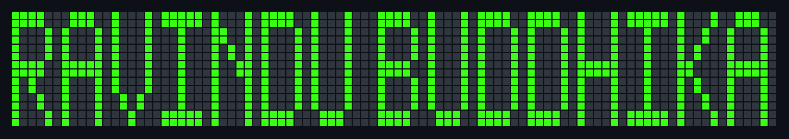

  

  

 

  

 

<pre align="left" style="background:#0D1117; font-family:'Fira Code','Courier New',monospace; padding:22px; border-radius:8px; line-height:1.6; font-size:14px;">
<b>ravindu@dev</b>:~$ whoami
Ravindu Buddhika

<b>ravindu@dev</b>:~$ cat role.txt
Trainee Software Engineer (Intern) @ SYGEN
Undergraduate | Professional Developer Diploma holder

<b>ravindu@dev</b>:~$ cat stack.txt
Core        : Spring Boot, React
Also using  : Next.js, Laravel, Django, Tauri, Supabase
Testing     : Unit / Integration testing

<b>ravindu@dev</b>:~$ cat focus.txt
Not just a framework specialist — building myself into
a well-rounded, overall developer: backend, frontend,
testing, and everything in between.

<b>ravindu@dev</b>:~$ _
</pre>

 

<!--STATS-START-->
<pre align="left" style="background:#0D1117; font-family:'Fira Code','Courier New',monospace; padding:22px; border-radius:8px; line-height:1.6; font-size:14px;">
<b>ravindu@dev</b>:~$ curl -s api.github.com/users/Ravindu-Buddhika | jq

  login          : Ravindu-Buddhika
  public_repos   : 35
  followers      : 6
  following      : 13
  member_since   : 07 May 2025

<b>ravindu@dev</b>:~$ cat github_stats.txt
  ┌──────────────────┬──────────────────┬──────────────────┐
  │  Total Commits    │  Current Streak  │  Longest Streak  │
  ├──────────────────┼──────────────────┼──────────────────┤
  │      510          │      5          │      9          │
  │  (last 12 months) │ Sep 01 - Sep 01  │ Apr 13 - Apr 21  │
  └──────────────────┴──────────────────┴──────────────────┘

<b>ravindu@dev</b>:~$ cat top_langs.txt
  Java        ███████░░░░░░░░░░░░░  32.56%
  HTML        █████░░░░░░░░░░░░░░░  26.53%
  JavaScript  ████░░░░░░░░░░░░░░░░  21.77%
  PHP         ███░░░░░░░░░░░░░░░░░  12.84%
  Blade       █░░░░░░░░░░░░░░░░░░░  6.29%

<b>ravindu@dev</b>:~$ # last synced: 2026-09-06 04:38 UTC
</pre>
<!--STATS-END-->

 

<pre align="left" style="background:#0D1117; font-family:'Fira Code','Courier New',monospace; padding:22px; border-radius:8px; line-height:1.6; font-size:14px;">
<b>ravindu@dev</b>:~$ cat contact.txt
LinkedIn : linkedin.com/in/ravindu-buddika-48a761369
Email    : ravindu@gmail.com

<b>ravindu@dev</b>:~$ _
</pre>

 

 

<pre style=" font-family:'Fira Code','Courier New',monospace; font-size:13px; line-height:1.3; display:inline-block; text-align:left;">
                                                                    _~_
                                                    ___            |oo ]
                                                   [ o ]           _\=/_
                                                   |===|          /     \
                                                   | 0 |          \|(-)|/
                                                   | 0 |           \| |/
                                                  _|___|_           |_|
                                                  |  |  |          /| |\
                                                  |__|__|         [ ] [ ]
                                                    | |             | |
                                                   _| |_           _| |_
                                                  /_)   (_\       /_)   (_\
----------------------------------------------------------------------------------------------------------------------------------
</pre>

  <b style="color:#39FF14;">Happy Coding! 💻✨</b>

